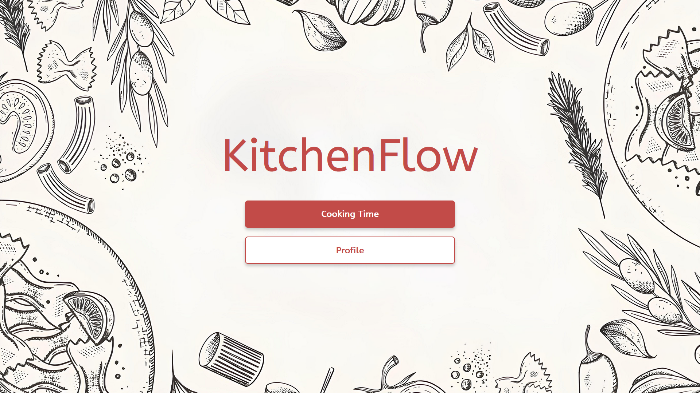
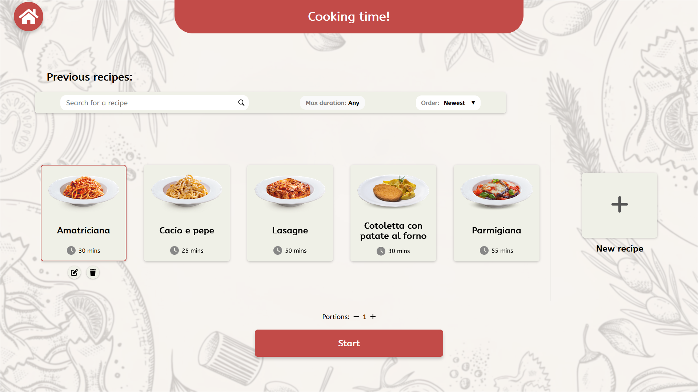
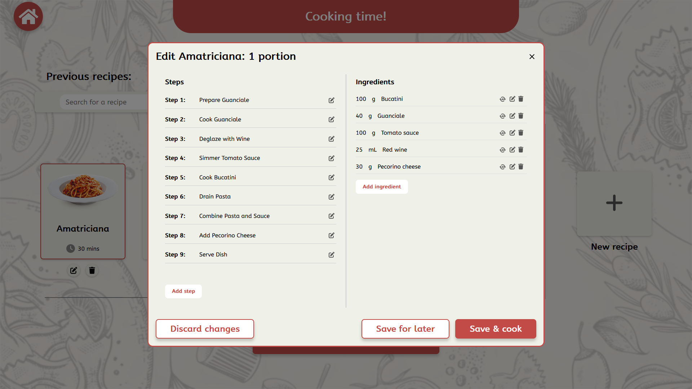
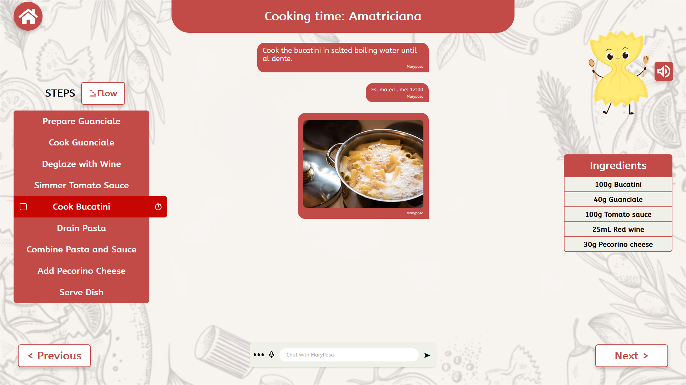
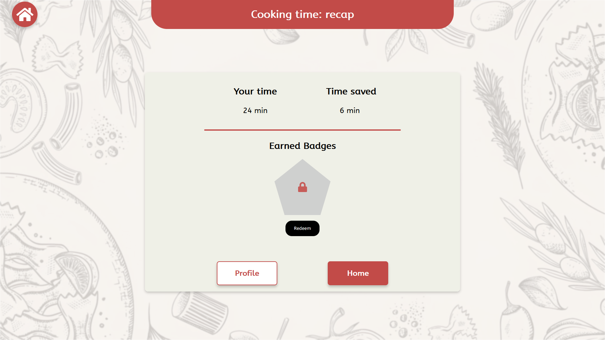
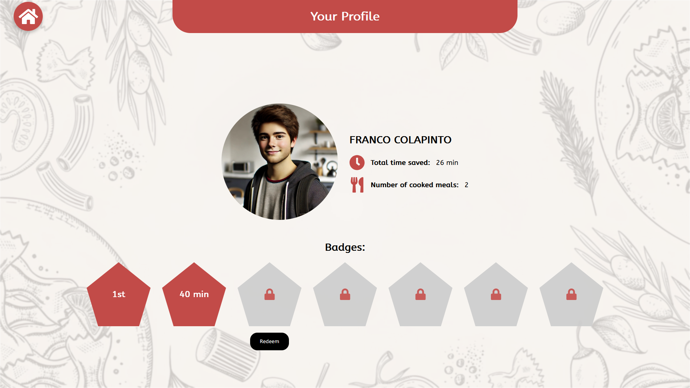
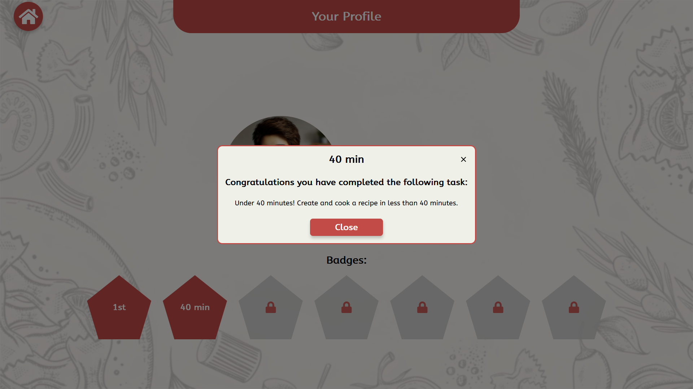
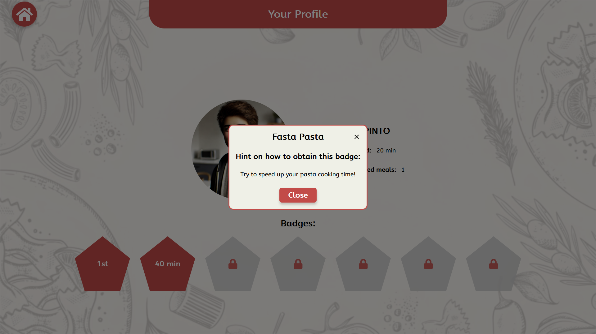

# Kitchen Flow App

Project for the course _"Human and Computer interaction"_ at _Politecnico di Torino_

## Application

This is a tablet base application, it's pourpose helps users who have difficulties in the kitchen. The user is able to create a recipe with the help of AI (hard coded in our case) and personalize the recipe to his liking. There is also a badge system in order to motivate the user to cook at home and improve his skills in the kitchen.

## Screenshots

### Home Screen

### Choosing the Recipe

### Editing the Recipe

### Cooking the Recipe

### Finished Cooking Recap

### Profile with Badges

### Obtained Badge Popup

### Hint Popup for Unobtain Badge

## Authors

This project was created by:

-   [Francesco Risso, s326834](mailto:s326834@studenti.polito.it)
-   [Giovanni Giordano, s331574](mailto:s331574@studenti.polito.it)
-   [Samuele Tallone, s334046](mailto:s334046@studenti.polito.it)